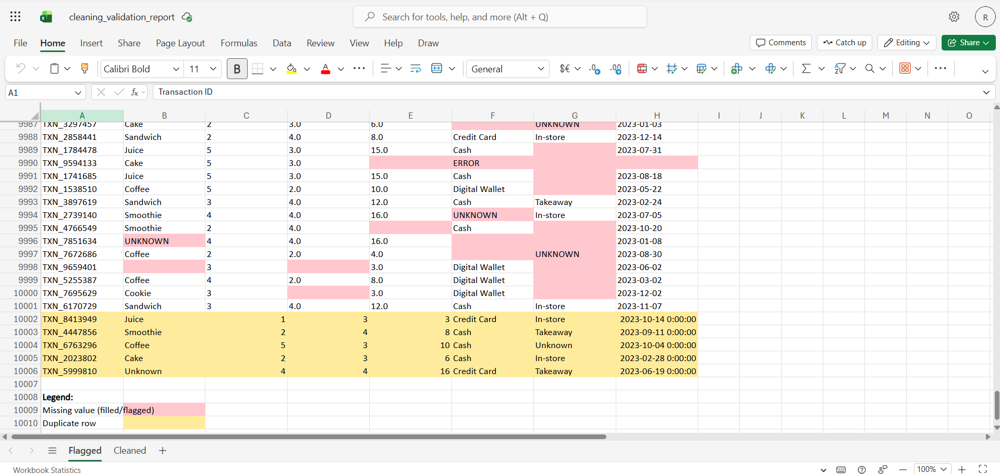

# Data Cleaning & Validation Tool

A Python tool that takes a messy, real-world-style dataset and turns it into a validated, audit-ready Excel report ,with every problem it found and fixed color-coded so you can see exactly what changed.

Previously built [Excel Report Automation](https://github.com/aanyatrivedi12/excel-report-automation), which worked with a clean dataset end-to-end. This project works the opposite direction: the dataset starts messy on purpose, to practice the part of analytics work that's actually hardest , cleaning and validating data before you can trust it.

## What it does

- Loads a 10,000-row transactional dataset ([Dirty Cafe Sales](https://www.kaggle.com/datasets/ahmedmohamed2003/cafe-sales-dirty-data-for-cleaning-training), Kaggle) with deliberately injected data quality issues
- Detects missing values, including disguised nulls like `"UNKNOWN"` and `"ERROR"` typed in as if they were real values, which `pandas` doesn't catch by default
- Fixes data type issues (numeric columns stored as text, dates that need parsing)
- Detects and removes duplicate transactions
- Standardizes inconsistent text formatting (extra whitespace, inconsistent capitalization)
- Validates date ranges to catch impossible values
- Outputs a 2-sheet Excel workbook:
  - **Flagged** -> the original messy data with every missing value and duplicate row highlighted, plus a legend
  - **Cleaned** -> the fully processed, analysis-ready dataset

## Why this approach

Most cleaning tutorials only show you the "after." This tool keeps the "before" too, so the report doubles as a data quality audit , useful if you ever need to show someone *what* was wrong with a dataset, not just hand them a clean one.

## Tools used

- Python (pandas, openpyxl)
- Google Colab

## How to run

1. Upload `dirty_cafe_sales.csv` to Google Colab (or your local environment)
2. Run all cells top to bottom
3. Download `cleaning_validation_report.xlsx` at the end

## What I learned

- Fake/disguised missing values (`"UNKNOWN"`, `"ERROR"`) need to be handled explicitly , pandas has no way to know they're not real values unless you tell it
- Once you clean a DataFrame in place, the "problems" are gone ,so if you want to report on what was wrong, you need to track issues *during* cleaning or keep a separate raw copy, not reconstruct them after
